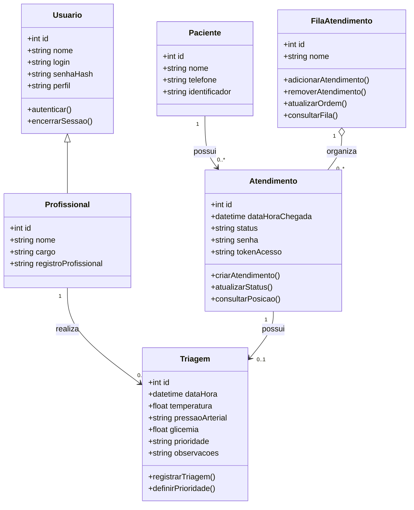

# 🏥 VezCerta — Sistema de Gestão e Acompanhamento de Filas (UBS)

> **Solução Web e Mobile para gerenciamento, organização e acompanhamento em tempo real das filas de atendimento da UBS Rosália Mota Almeida — Quixeramobim.**

[](https://github.com/talle5/trabalho_ES)
[](https://www.figma.com/proto/rKSutBgNt2mCGvUYm8cOHF/Prot%C3%B3tipo-de-Alta-Fidelidade---UBS)
[](./Documento%20de%20Especificação%20de%20Requisitos.pdf)

---

## 👥 Equipe do Projeto

- **Maria Eduarda Spinosa Braga Leandro**
- **Rian Cristhian Brito da Silva**
- **Talles André Lopes Lima**
- **Francisca Issllany de Sousa Braga**
- **João Luiz Bezerra das Chagas**

---

## 📌 Sumário

1. [Sobre o Projeto](#-sobre-o-projeto)
2. [Parte 2 — Figma, Modelos e Arquitetura de Software](#parte-2--figma-modelos-e-arquitetura-de-software)
   - [1. Telas do Sistema e Validação com o Cliente](#1-figma-telas-do-sistema-e-evidências-de-validação-com-o-cliente)
     - [1.1 Links dos Protótipos no Figma](#11-links-dos-protótipos-no-figma)
     - [1.2 Identidade Visual e Paleta de Cores](#12-identidade-visual-e-paleta-de-cores)
     - [1.3 Módulo Paciente (Mobile First / PWA)](#13-módulo-paciente-mobile-first--pwa)
     - [1.4 Módulo Recepção / Triagem (Web Desktop)](#14-módulo-recepção--triagem-web-desktop)
     - [1.5 Relatório de Evidências de Validação](#15-relatório-de-evidências-de-validação-com-o-cliente)
   - [2. Diagrama de Classes](#2-diagrama-de-classes)
     - [2.1 Representação Visual e Mermaid](#21-representação-do-diagrama-de-classes)
     - [2.2 Detalhamento das Classes e Métodos](#22-descrição-das-classes)
     - [2.3 Relacionamentos](#23-relacionamentos-entre-as-classes)
   - [3. Diagramas de Atividades](#3-diagramas-de-atividades)
     - [3.1 Macrofluxo Integrado do Atendimento](#31-macrofluxo-integrado-do-atendimento)
     - [3.2 Fluxos Específicos em UML](#32-fluxos-específicos-em-uml)
       - [Fluxo 1: Cadastro e Adição à Fila](#1-cadastro-e-adição-à-fila)
       - [Fluxo 2: Visualização da Fila pelo Paciente](#2-visualização-da-fila-pelo-paciente)
       - [Fluxo 3: Solicitar Cancelamento de Consulta](#3-solicitar-cancelamento-de-consulta-paciente)
       - [Fluxo 4: Solicitações de Cancelamento](#4-gerenciamento-de-solicitações-de-cancelamento-atendente)
       - [Fluxo 5: Gerenciamento da Fila e Baixa](#5-gerenciamento-da-fila-e-baixa-atendente)
   - [4. Arquitetura do Sistema e Stack Tecnológica](#4-arquitetura-do-sistema)
     - [4.1 Estilo Arquitetural](#41-visão-geral-e-estilo-arquitetural)
     - [4.2 Módulos do Sistema](#42-módulos-do-sistema)
     - [4.3 Stack Tecnológica Justificada](#43-tecnologias-utilizadas-stack-tecnológica-justificada)

---

## 💡 Sobre o Projeto

O **VezCerta** é um sistema desenvolvido para otimizar a experiência de atendimento nas Unidades Básicas de Saúde (UBS), tendo como contexto de aplicação a **UBS Rosália Mota Almeida em Quixeramobim**.

### Problema
Superlotação nas salas de espera, falta de clareza do paciente em relação à sua previsão de atendimento e sobrecarga de trabalho dos profissionais da recepção e triagem com perguntas constantes sobre o andamento da fila.

### Solução Proposta
Uma plataforma integrada composta por:
1. **Painel Web (Desktop) para Atendentes e Triagem**: registro de chegada, ordenação por prioridades legais e de triagem, controle de chamadas e monitoramento de ausências.
2. **Aplicativo Web/PWA (Mobile) para Pacientes**: acesso instantâneo via QR Code ou link, exibindo posição em tempo real, tempo estimado e notificações de chamada sem necessidade de permanência aglomerada na sala de espera.

---

# PARTE 2 — FIGMA, MODELOS E ARQUITETURA DE SOFTWARE

## 1. FIGMA, TELAS DO SISTEMA E EVIDÊNCIAS DE VALIDAÇÃO COM O CLIENTE

### 1.1 Links dos Protótipos no Figma

- 🖥️ **[Protótipo Web — Módulo Atendente / Recepção](https://www.figma.com/proto/rKSutBgNt2mCGvUYm8cOHF/Prot%C3%B3tipo-de-Alta-Fidelidade---UBS?node-id=122-277&p=f&t=Ioykrn16y7Bq6IQJ-1&scaling=min-zoom&content-scaling=fixed&page-id=112%3A241&starting-point-node-id=122%3A277)**
- 📱 **[Protótipo Mobile — Módulo Paciente](https://www.figma.com/proto/rKSutBgNt2mCGvUYm8cOHF/Prot%C3%B3tipo-de-Alta-Fidelidade---UBS?node-id=1-3&p=f&t=vvrlcQXM4hmnSqL1-1&scaling=scale-down&content-scaling=fixed&page-id=0%3A1&starting-point-node-id=1%3A3)**

---

### 1.2 Identidade Visual e Paleta de Cores

As interfaces foram projetadas seguindo princípios de acessibilidade, contraste adequado para o ambiente de saúde pública e clareza nas ações:

<p align="center">
  
</p>

| Amostra | Código Hex | Nome / Função | Descrição e Aplicação |
| :---: | :---: | :--- | :--- |
|  | `#004F9F` | **Azul Principal** | Cabeçalho, destaque da posição do usuário e barra inferior de navegação. |
|  | `#181E2B` | **Azul Escuro / Grafite** | Tipografia principal, títulos e elementos de alto contraste textual. |
|  | `#FA5056` | **Vermelho / Coral** | Ações destrutivas, alertas e botão de desistência da fila. |
|  | `#F2F6FC` | **Azul Muito Claro** | Plano de fundo das páginas para conforto visual. |
|  | `#FFF1F2` | **Rosa Claro** | Preenchimento secundário do botão e modais de cancelamento. |

---

### 1.3 Módulo Paciente (Mobile First / PWA)

Projetado para ser acessado diretamente pelo smartphone do paciente sem necessidade de download em lojas de aplicativo:

#### 1. Tela de Login e Cadastro
Interface inicial de autenticação simplificada, permitindo o ingresso com credenciais ou novo registro e redirecionamento direto para o painel de atendimento.

<p align="center">
  
  
  
</p>

#### 2. Tela de Fila de Espera
- Cabeçalho em tom azul com marca da aplicação e guias dos atendimentos ativos.
- Listagem central com **Posição** e **Nome**, destacando o usuário com tag azul **"Você"**.
- Botão inferior destacado em vermelho para desistência/cancelamento voluntário da consulta com confirmação.
- Barra de navegação inferior permanente:
  - **Esquerda**: Unidades de Saúde (localização).
  - **Centro**: Fila de Atendimento (seção ativa).
  - **Direita**: Perfil do Usuário.

<p align="center">
  
  
  
</p>

#### 3. Fluxo de Cancelamento de Atendimento
Permite ao paciente liberar sua vaga na fila com aviso prévio de confirmação e feedback imediato de conclusão do cancelamento:

<p align="center">
  
  
  
</p>

#### 4. Unidades de Saúde, Perfil e Histórico
- **Unidades de Saúde**: exibe dados geográficos e endereço da UBS vinculada.
- **Perfil do Paciente**: dados cadastrais e opções da conta.
- **Histórico de Atendimentos**: consultas anteriores e status de encerramento de cada chamada.

<p align="center">
  
  
  
</p>

---

### 1.4 Módulo Recepção / Triagem (Web Desktop)

Interface otimizada para computadores da recepção da UBS, priorizando velocidade de operação e visão simultânea das filas de atendimento:

#### 1. Tela de Login
Autenticação restrita de atendentes com e-mail e senha corporativa.

<p align="center">
  
</p>

#### 2. Tela de Fila (Acompanhamento por Médico)
- **Menu Lateral**: navegação principal para alternar entre *Fila*, *Consultas*, *Solicitações de saída*, *Meu perfil*, *Configurações* e *Sair*.
- **Cabeçalho**: mensagem de saudação (*"Bom dia!"*), data atual (*18/06/2026*) e indicação da unidade (*UBS CENTRO*).
- **Barra de Busca**: campo *"Buscar fila por médico ou paciente"* para localização ágil.
- **Visualização da Fila**: navegação por guias superiores organizadas por profissional e especialidade (*Dr. Ricardo Mendes - Clínico Geral*, *Dra. Luiza Freitas - Dentista*, *Dr. Pedro Henrique - Cardiologista*, *Dra. Juliana Silva - Nutricionista*).
- **Tabela de Atendimento**: listagem com Posição (*1º, 2º, 3º*), Nome do Paciente e ação de controle com botão destacado *"Remover paciente"* para gerenciar desistências.

<p align="center">
  
</p>

#### 3. Tela de Consultas
- **Navegação**: mantém o menu lateral e inclui breadcrumb no topo (`> Consultas`).
- **Ação Principal**: botão em destaque *"Cadastrar nova consulta"* no canto superior direito.
- **Filtro por Profissional**: abas superiores para alternar a visualização das consultas entre os médicos.
- **Listagem de Agendamentos**: lista os pacientes agendados para a data selecionada com nome completo e CPF, com aviso de reinício automático de registro de fila após o último paciente atendido.

<p align="center">
  
</p>

#### 4. Tela de Solicitações de Saída
- **Indicador no Menu**: ícone de notificação com contador dinâmico (ex.: indicador `3` solicitações pendentes).
- **Organização por Médico**: seleção de abas para filtrar as solicitações pelo profissional responsável.
- **Listagem de Solicitações**: cartões com dados do paciente (Nome e CPF), horário da solicitação e botão de ação *"Aceitar Solicitação"*.

<p align="center">
  
</p>

#### 5. Tela de Meu Perfil
- **Cabeçalho de Perfil**: foto/avatar, nome completo (*Mariana Costa Ferreira*), cargo (*Atendente · Recepção*), perfil de acesso (*atendente*), unidade vinculada (*UBS CENTRO*) e matrícula (*ATD-0042*).
- **Dados Pessoais e de Contato**: formulário editável para manutenção das informações do usuário.
- **Vínculo Profissional e Segurança**: bloco informativo com os dados de lotação na unidade e gerenciamento de credenciais de acesso.

<p align="center">
  
</p>

---

### 1.5 Relatório de Evidências de Validação com o Cliente

- **Cliente / Validadora**: Eliane Brito (Técnica de Enfermagem).
- **Método Utilizado**: Chamada de vídeo no Google Meet com demonstração interativa e navegação pelos fluxos do protótipo.

| Item Testado | Feedback do Cliente | Ação / Ajuste Realizado |
| :--- | :--- | :--- |
| **Protótipo Web (Recepção)** | Aprovou a interface, organização visual das telas e fluxo ágil de navegação. | Mantido conforme apresentado. |
| **Funcionalidades do Protótipo Web** | Considerou que o conjunto de recursos atende com precisão às rotinas diárias da recepção da UBS. | Funcionalidades aprovadas e mantidas. |
| **Protótipo Mobile (Paciente)** | Aprovou a facilidade de acompanhamento e simplicidade da interface mobile. | Mantido conforme apresentado. |
| **Validação Geral** | Aprovou a solução global sem necessidade de alterações estruturais nesta etapa. | Protótipo homologado para a fase de desenvolvimento. |

<p align="center">
  
  <br />
  <em>Registro da reunião de apresentação e validação com a técnica de enfermagem Eliane Brito.</em>
</p>

---

## 2. DIAGRAMA DE CLASSES

### 2.1 Representação do Diagrama de Classes

O diagrama de classes modela a estrutura de dados e as operações do domínio de triagem e controle de filas da UBS:

<p align="center">
  
</p>



---

### 2.2 Descrição das Classes

1. **`Usuario`**:
   - Representa os operadores com acesso ao sistema administrativo.
   - Atributos: `id`, `nome`, `login`, `senhaHash`, `perfil`.
   - Métodos: `autenticar()`, `encerrarSessao()`.
2. **`Profissional`**:
   - Especialização de `Usuario`, representando atendentes, enfermeiros e médicos da UBS.
   - Atributos adicionais: `cargo`, `registroProfissional`.
3. **`Paciente`**:
   - Representa os cidadãos atendidos pela unidade.
   - Atributos: `id`, `nome`, `telefone`, `identificador` (CNS/CPF).
4. **`Atendimento`**:
   - Registra o ciclo de uma visita do paciente à unidade.
   - Atributos: `id`, `dataHoraChegada`, `status` (*Aguardando* → *Em atendimento* → *Finalizado*), `senha`, `tokenAcesso`.
   - Métodos: `criarAtendimento()`, `atualizarStatus()`, `consultarPosicao()`.
   - *Nota*: `tokenAcesso` gera a chave única para consulta via QR Code/PWA móvel.
5. **`Triagem`**:
   - Dados clínicos preliminares coletados antes da consulta médica.
   - Atributos: `id`, `dataHora`, `temperatura`, `pressaoArterial`, `glicemia`, `prioridade`, `observacoes`.
   - Métodos: `registrarTriagem()`, `definirPrioridade()`.
6. **`FilaAtendimento`**:
   - Gerencia a ordenação e sequência dos atendimentos ativos.
   - Atributos: `id`, `nome`.
   - Métodos: `adicionarAtendimento()`, `removerAtendimento()`, `atualizarOrdem()`, `consultarFila()`.

---

### 2.3 Relacionamentos entre as Classes

- **`Paciente 1 → 0..* Atendimento`**: um paciente pode possuir múltiplos atendimentos ao longo do tempo.
- **`Atendimento 1 → 0..1 Triagem`**: cada atendimento possui no máximo uma avaliação de triagem associada.
- **`Profissional 1 → 0..* Triagem`**: um profissional pode realizar a triagem de múltiplos pacientes.
- **`FilaAtendimento 1 o-- 0..* Atendimento`**: agregação onde a fila organiza dinamicamente diversos atendimentos.
- **`Usuario <|-- Profissional`**: herança direta para reaproveitamento de credenciais e permissões.

---

## 3. DIAGRAMAS DE ATIVIDADES

A modelagem de atividades do sistema **VezCerta** é composta por um macrofluxo geral de atendimento e por diagramas específicos em UML modelados com o conceito de raias (*swimlanes*), delimitando claramente as responsabilidades entre os atores envolvidos (**Atendente**, **Sistema** e **Paciente**).

---

### 3.1 Macrofluxo Integrado do Atendimento

Visão ponta a ponta do ciclo de vida do paciente desde a chegada à unidade até o desfecho clínico:

<p align="center">
  
</p>

1. **Atendente (Módulo Web)**: busca/cadastra o paciente, registra a chegada e aciona a chamada do próximo paciente.
2. **Sistema VezCerta (Backend & WebSocket)**: valida informações, posiciona na fila por prioridade, emite notificações em tempo real e processa o comparecimento ou ausência (*no-show*).
3. **Paciente (Módulo Mobile / PWA)**: acompanha o andamento em tempo real pelo smartphone e possui autonomia para cancelar ou comparecer ao atendimento.

---

### 3.2 Fluxos Específicos em UML

Os fluxos a seguir detalham pontualmente cada operação operacional do sistema:

#### 1. Cadastro e Adição à Fila
Mapeia a entrada do paciente no fluxo da UBS pela recepção, com checagem de cadastro prévio e classificação de prioridade:

- **Raias**: `Atendente` e `Sistema`
- **Etapas**:
  1. O **Atendente** acessa a tela e insere as informações do paciente.
  2. O **Sistema** verifica se o cadastro já existe:
     - *Se não existir*: habilita o formulário para preenchimento dos dados básicos.
     - *Se já existir*: carrega e exibe os dados cadastrais do paciente automaticamente.
  3. O **Atendente** preenche os dados da consulta e avalia se o paciente é prioridade:
     - *Não prioritário*: mantido na fila convencional.
     - *Prioritário*: registrado como prioritário com justificativa do motivo (idade, gestação, etc.).
  4. O **Atendente** confirma *"Adicionar à fila"*, e o **Sistema** exibe o paciente na lista de espera.

<p align="center">
  
</p>

---

#### 2. Visualização da Fila pelo Paciente
Descreve o fluxo de consulta remota da posição e estimativa de espera via dispositivo móvel:

- **Raias**: `Paciente` e `Sistema`
- **Etapas**:
  1. O **Paciente** acessa o sistema mobile e insere suas credenciais ou token de acesso.
  2. O **Sistema** valida os dados do paciente.
  3. O **Sistema** retorna a posição na fila em tempo real juntamente com as informações da consulta agendada.
  4. O **Paciente** visualiza a sua colocação e acompanha a evolução da fila.

<p align="center">
  
</p>

---

#### 3. Solicitar Cancelamento de Consulta (Paciente)
Permite ao paciente liberar sua vaga na fila voluntariamente caso não possa aguardar:

- **Raias**: `Paciente` e `Sistema`
- **Etapas**:
  1. O **Paciente** acessa o aplicativo mobile, seleciona a consulta e clica em *"Solicitar cancelamento"*.
  2. O **Sistema** exibe modal de confirmação.
  3. O **Paciente** confirma o cancelamento.
  4. O **Sistema** processa a solicitação e avalia a aprovação:
     - *Se aprovado*: remove o paciente da fila, atualiza o status para cancelado, recalcula a posição dos pacientes seguintes, registra a aprovação e envia notificação de confirmação.
     - *Se não aprovado*: mantém o paciente na fila, registra a recusa e notifica o paciente.
  5. O **Paciente** visualiza o feedback na tela.

<p align="center">
  
</p>

---

#### 4. Gerenciamento de Solicitações de Cancelamento (Atendente)
Trata a análise e homologação das saídas solicitadas pelos pacientes pela recepção:

- **Raias**: `Atendente` e `Sistema`
- **Etapas**:
  1. O **Atendente** acessa a tela de solicitações de cancelamento e checa a existência de pedidos pendentes:
     - *Sem solicitações*: o **Sistema** exibe o aviso *"Não há solicitações"*.
     - *Com solicitações*: o **Atendente** seleciona o pedido e decide aceitar ou recusar:
       - *Recusar*: informa o motivo e o **Sistema** notifica o paciente.
       - *Aceitar*: confirma a solicitação, o **Sistema** remove o paciente da fila, altera o status do atendimento para cancelado, atualiza a ordenação da fila e emite a notificação ao paciente.

<p align="center">
  
</p>

---

#### 5. Gerenciamento da Fila e Baixa (Atendente)
Controla o avanço dos atendimentos e desfechos de presença ou desistência direta no balcão:

- **Raias**: `Atendente` e `Sistema`
- **Etapas**:
  1. O **Atendente** acessa o painel de filas com suas credenciais.
  2. Diante da chamada, avalia: *Paciente compareceu à consulta?*
     - *Sim (Compareceu)*: o **Atendente** dá baixa na consulta e o **Sistema** atualiza imediatamente a ordem da fila.
     - *Não (Ausente / Desistente)*: o **Atendente** clica em *"Remover paciente da fila"*, o **Sistema** solicita confirmação, o **Atendente** confirma e o **Sistema** processa a remoção e reorganiza a fila.

<p align="center">
  
</p>

---

## 4. ARQUITETURA DO SISTEMA

### 4.1 Visão Geral e Estilo Arquitetural

A aplicação segue o padrão **Cliente-Servidor em Três Camadas**:

```text
┌─────────────────────────────────────────────────────────────┐
│                      CAMADA DE FRONT-END                    │
│   [ Módulo Paciente - PWA ]     [ Módulo Recepção - Web ]   │
│       (React + Tailwind)            (React + Tailwind)      │
└──────────────────────────────┬──────────────────────────────┘
                               │ HTTPS / WSS (WebSocket)
                               ▼
┌─────────────────────────────────────────────────────────────┐
│                      CAMADA DE BACK-END                     │
│               [ Node.js + TypeScript + Express ]            │
│        • JWT Auth       • Engine de Fila e Prioridades      │
│        • Socket.io      • Cálculo de Estimativa de Espera   │
└──────────────────────────────┬──────────────────────────────┘
                               │ Prisma ORM
                               ▼
┌─────────────────────────────────────────────────────────────┐
│                    CAMADA DE PERSISTÊNCIA                   │
│                     [ PostgreSQL Database ]                 │
└─────────────────────────────────────────────────────────────┘
```

---

### 4.2 Módulos do Sistema

1. **Módulo de Autenticação e Usuários**:
   - Autenticação via JSON Web Tokens (JWT) para operadores da recepção.
   - Controle de permissões para operações críticas (chamar, remover e reordenar).
2. **Módulo de Gestão da Fila**:
   - Algoritmo de intercalação entre fila convencional e prioridades (idosos, gestantes, PCDs).
   - Gestão de status do consultório (*Ativo*, *Em Pausa*).
3. **Módulo de Estimativa de Tempo de Espera**:
   - Cálculo baseado na posição na fila multiplicada pelo histórico médio de tempo de atendimento do médico.
   - Pausa automática da contagem quando o consultório estiver em intervalo.
4. **Módulo de Notificações em Tempo Real**:
   - Comunicação bidirecional via WebSockets (`Socket.io`).
   - Atualização do painel mobile em menos de 2 segundos a cada mudança na fila.

---

### 4.3 Tecnologias Utilizadas (Stack Tecnológica Justificada)

| Camada | Tecnologia | Justificativa Técnica |
| :--- | :--- | :--- |
| **Interface Paciente (Celular)** | **React (PWA) + Tailwind CSS** | Leve e responsivo. Por ser PWA/Web, o paciente não precisa instalar aplicativo da loja nem ocupar memória do smartphone — basta ler o QR Code ou acessar o link. O Tailwind garante alta legibilidade e contraste. |
| **Interface Recepção (Desktop)** | **React + Tailwind CSS** | Interface desktop moderna, ágil e com controle simultâneo de múltiplos consultórios em um único painel. |
| **Back-end (API)** | **Node.js (Express / NestJS) + TypeScript** | Alto desempenho em requisições assíncronas e I/O intensivo. A tipagem estrita do TypeScript reduz bugs no manuseio de dados dos pacientes e ordens de fila. |
| **Comunicação em Tempo Real** | **Socket.io (WebSockets)** | Atualiza o smartphone do paciente instantaneamente assim que a fila anda, eliminando a necessidade de recarregar a página (F5). |
| **Banco de Dados** | **PostgreSQL** | SGBD relacional robusto, confiável e compatível com transações ACID essenciais para consistência de filas e histórico médico. |
| **ORM** | **Prisma ORM** | Mapeamento objeto-relacional tipado de ponta a ponta, agilizando queries seguras e migrações do banco. |

---

## 📂 Estrutura de Diretórios do Repositório

```bash
trabalho_ES/
├── Documento de Especificação de Requisitos.pdf # Documentação de Requisitos
├── Protótipo de Alta Fidelidade - UBS/          # Exportações das telas do Figma
│   ├── mobile/                                  # Módulo Paciente (Mobile First / PWA)
│   └── web/                                     # Módulo Recepção / Triagem (Web Desktop)
├── docs/
│   ├── cores/                                   # Amostras das cores da paleta
│   └── diagramas/                               # Modelagem visual do sistema
│       ├── diagrama_de_classes.png              # Diagrama de Classes UML
│       ├── diagrama_de_atividades.png           # Macrofluxo Geral de Atividades
│       └── Diagrama de atividades /             # Diagramas de Atividades por fluxo (UML)
│           ├── IMG-20261007-WA0024.jpg          # Gerenciamento de Fila
│           ├── IMG-20261007-WA0025.jpg          # Visualização da Fila
│           ├── IMG-20261007-WA0026.jpg          # Solicitações de Cancelamento
│           ├── IMG-20261007-WA0027.jpg          # Cadastro e Adição à Fila
│           └── IMG-20261007-WA0028.jpg          # Solicitar Cancelamento de Consulta
├── registro de entrevista.jpeg                  # Evidência da validação com o cliente
└── README.md                                    # Documentação principal
```
